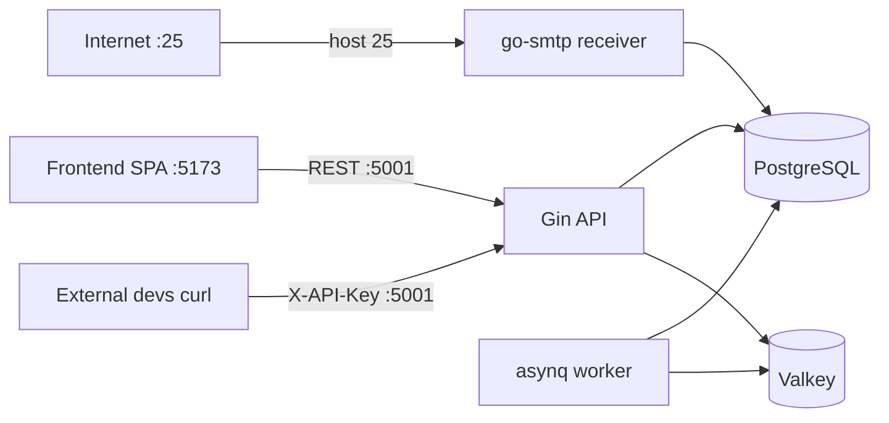

# Backend Architecture

Go (Gin) backend for the tempmail service. One binary, three roles: HTTP API, SMTP receiver, background worker.

## Components

| Component | Tech | Port / Store | Role |
|---|---|---|---|
| HTTP API | Gin | `:5001` (`TEMPMAIL_PORT`) | Public REST API consumed by frontend + external devs |
| SMTP receiver | emersion/go-smtp | `:2525` (`TEMPMAIL_SMTP_PORT`) | MX intake; published directly as host `25:2525` in prod |
| Worker | hibiken/asynq (scheduler+server, same process) | — | Hourly purge of expired inboxes/emails; 30-min MX re-verify refresh |
| Database | PostgreSQL 16 (`jackc/pgx/v5` + `jmoiron/sqlx`) | `postgres:5432` | inboxes, emails, domains, apikeys |
| Queue + cache | Valkey 8 (`go-redis/v9`, asynq) | `valkey:6379` | asynq jobs; MX-verification cache; rate-limit counters |

## Request paths

## Dev workflow

1. `task dev` — full dev stack (Go backend source-mounted + postgres + valkey); env from repo-root `.env` (`--env-file`), fallback in-stack defaults.
2. Backend manual (optional): `cd backend && go run ./cmd/server` (reads `backend/.env`).
3. Frontend manual: `cd frontend && npm run dev` (Vite :5173, calls API on :5001) — no frontend container in dev compose anymore.
4. Deploy: `task dev` only *runs* the dev stack (nothing to push — backend is source-mounted, dev never touches GHCR). GHCR builds are **prod-only**: `.github/workflows/build-push.yml` builds `docker/prod/Dockerfile` (on `main` push, tags `v*`, or manual dispatch), multi-arch `amd64+arm64`. The Dockerfile keeps builds fast by running `npm ci`/`go build` natively on `$BUILDPLATFORM` and cross-compiling Go via `GOARCH=$TARGETARCH` (explicit `ARG TARGETARCH` required — under the `dockerfile:1` frontend the var resolves empty in a pinned stage otherwise), so only the final runtime stage runs per-target. On a tag push `v1.0.0` it auto-bumps to `v1.0.1` (annotated tag on the same commit; GITHUB_TOKEN push → no re-trigger loop) and pushes `ghcr.io/<owner>/tempmail-xgmail:{v1.0.1,latest,sha-<commit>}`; `main` pushes push `:{prod,latest,sha-<commit>}`. Manual fallback: `docker build -f docker/prod/Dockerfile -t <registry>/tempmail-xgmail:<tag> . && docker push ...` then `docker compose --env-file .env -f docker/prod/docker-compose.yaml pull && up -d` on the server — env keys are all `TEMPMAIL_`-prefixed in `.env`, so a stale published image silently falls back to defaults.
5. Full stack prod-like: `docker compose --env-file .env -f docker/prod/docker-compose.yaml up -d` — Caddy (TLS via Cloudflare DNS-01) → `app` image (SPA + API + SMTP) + postgres + valkey; app image override: `TEMPMAIL_APP_IMAGE` (default `ghcr.io/zengkuni/tempmail-xgmail:latest`). Cloudflare proxy + Caddy setup: [`proxy-caddy-cloudflare.md`](proxy-caddy-cloudflare.md).

## Tables

- `inboxes` — one row per generated address (PK = address); expiry enforced by the hourly purge job (PostgreSQL has no TTL index).
- `emails` — parsed mail; ULID string id (26-char Crockford, matches API docs); `sender`/`recipients`/`headers`/`attachments` as JSONB; expiry enforced by the hourly purge job.
- `domains` — served domains; unique `name`; `isDefault`+`isActive` drive random-domain selection and SMTP RCPT acceptance.
- `apikeys` — API keys; unique `key`; public key seeded from `TEMPMAIL_PUBLIC_API_KEY` env at boot.

Auth model: every `/api/*` request carries `X-API-Key` validated against `apikeys`. No JWT/users/admin panel (frontend contract has none). Realtime websockets are omitted — the frontend has no socket client; clients poll `GET /api/emails`.
